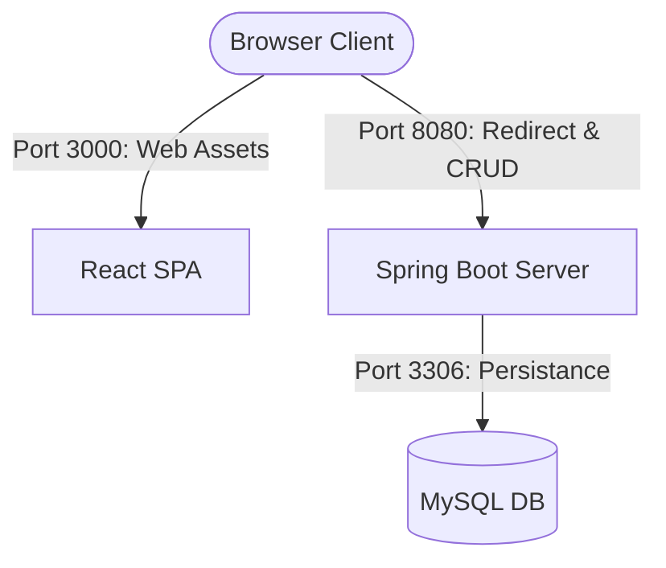
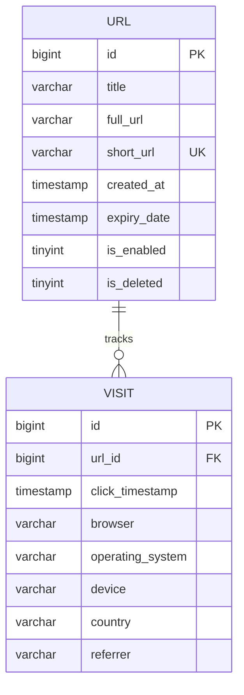

# System Architecture - URL Shortener

This document outlines the architecture, database schemas, and API communications of the URL Shortener application.

## 1. High-Level Component Layout

The system is deployed using three Docker containerized services:
1. **Frontend (Port 3000)**: Serves the compiled React app using Nginx.
2. **Backend API Server (Port 8080)**: Hosts the REST endpoints and handles HTTP redirections.
3. **Database (Port 3306)**: MySQL instance containing tables for URLs and visits.

---

## 2. Database Schema

### Table: `url`
- Stores shortened URL metadata. Soft-delete is controlled by the `is_deleted` column.
- The `short_url` column has a unique key constraint to support alias collision prevention.

### Table: `visit`
- Stores individual redirect clicks.
- Linked via foreign key constraint `fk_visit_url` targeting `url.id` with `ON DELETE CASCADE`.

---

## 3. REST API Endpoint Catalog

### Public Endpoints
- **GET `/{shortenString}`**
  - Redirects user to the original URL with a `302 Found` status.
  - Automatically reads the IP, User-Agent, and Referrer headers to write visit analytics.

### REST API (Prefix: `/api`)
- **POST `/api/links`**: Create short link.
  - Body: `CreateLinkRequest` (title, fullUrl, customAlias, expiryDate)
- **GET `/api/links`**: Search & paginate links list.
  - Query Params: `search` (filter string), `page` (int), `size` (int), `sort` (string)
- **GET `/api/links/{id}`**: Fetch single link details.
- **PUT `/api/links/{id}`**: Update link settings.
  - Body: `UpdateLinkRequest` (title, customAlias, expiryDate, enabled)
- **DELETE `/api/links/{id}`**: Soft delete link.
- **GET `/api/links/{id}/analytics`**: Fetch charts analytics data for a link.
- **GET `/api/analytics/summary`**: Fetch high level metrics summary.
